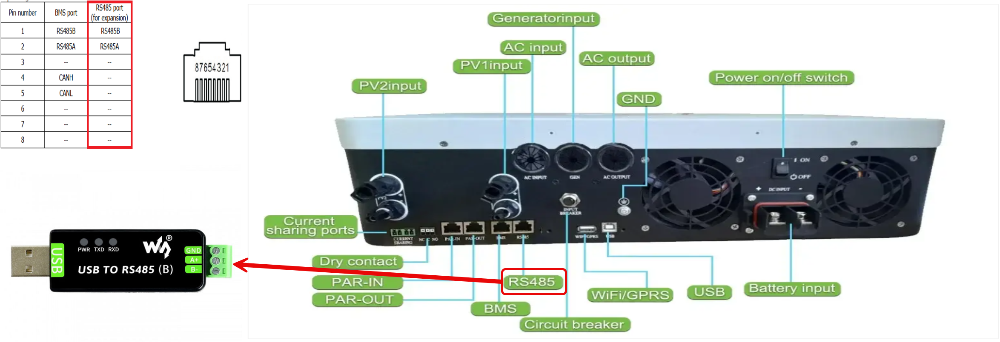

# ESPHome Integration for Growatt SPF 6000ES Plus

Monitor and control your Growatt SPF 6000ES Plus solar inverter via RS485 (Modbus RTU) using ESPHome.

## Acknowledgements

This project is inspired by and builds upon the following open-source works:

- [klatremis/esphome-for-growatt](https://github.com/klatremis/esphome-for-growatt)
- [x230-thinkpad/growatt-spf-6000es-plus_RS485-USB_Modbus](https://github.com/x230-thinkpad/growatt-spf-6000es-plus_RS485-USB_Modbus)

Special thanks to the authors for their valuable contributions!

